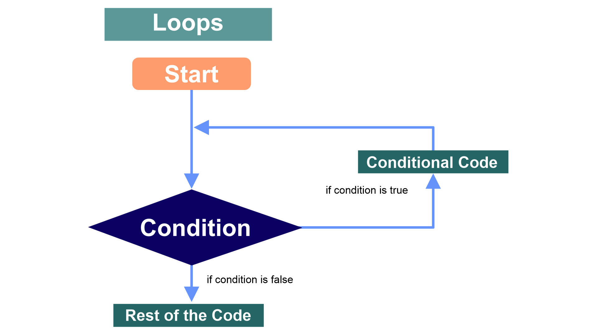
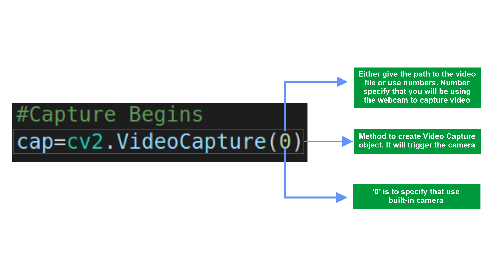
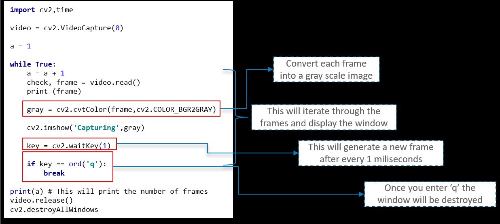

# Short Tutorial

We have discussed in breif about some of the important libraries which are being used for data analysis. And So now, we would provide a very beginner friendly guide which will demonstrate how to use these libraries and will make you equipped so that you are able to tackle the actual project on your own.

We installed all libraries in virtual environment.

You can create na new python file and riquired libraries import. 

```python
# importing the libraries
import cv2
import numpy as np
```

Now, lets take look to capturing videos using OpenCV is pretty simple as well. the following loop will give you a better idea. Check it out:



The images are read one-by-one and hence videos are produced due to fast processing of frames which makes the individual images move.

## Capturing Video
---



We have a method called **VideoCapture** which is used to create the VideoCapture object. This method is used to trigger the camera on the user's machine. The parameter to this function denotes if the program should make use of the built-in camera or an add-on camera. '0' denotes the built-in camera in this case.

Here's the code snippet image:



In order to capture the video, we will be using the **while** loop. while condition will be such that, untill unless **'check'** is **True**. If it is, then Python will display the frames.

> while (video.isOpened()):

One more way for while condition will be **video.isOpened()** will just check if the video file can be opened for reading but it will not return a false when end of video file is reached.

> check, frame = video.read()

**<name_of_constant>.read()**. Basically, check is a boolean regarding whether or not there was a return at all, at the frame is each frame that is returned. If there is no frame, you wont get an error, you will get None.

> gray = cv2.cvtColor(frame, cv2.COLOR_BGR2GRAY)

We have **cvtColor** function which is used for converts an image from one color space to another.

The function converts an input image from one color space to another. In case of a transformation to-from RGB color space, the order of the channels should be specified explicitly (RGB or BGR). Note that the default color format in OpenCV is often referred to as RGB but it is actually BGR (the bytes are reversed). So the first byte in a standard (24-bit) color image will be an 8-bit Blue component, the second byte will be Green, and the third byte will be Red. The fourth, fifth, and sixth bytes would then be the second pixel (Blue, then Green, then Red), and so on.

> cv2.imshow('Capturing', gray)

To display an image using opencv cv2 library, you can use **cv2.imshow()** function.

where **Capturing** is the title of the window in which the **gray** numpy.ndarray will be shown. If a window is not created already, a new window will be created to fit the image.

> if cv2.waitKey(1) & 0xFF == ord('q'):<br>
&nbsp;&nbsp;&nbsp;&nbsp;&nbsp;&nbsp;&nbsp;&nbsp;&nbsp;&nbsp;&nbsp; break

This statement just runs once per frame. Basically, if we get a key, and that key is a q, we will exit the while loop with a break, which then runs:

>cap.release()<br>
cv2.destroyAllWindows()

This releases the webcam, then closes all of the imshow() windows.

---
some other function in opencv library:

>cv2.rectangle(image, starting_coordinate , ending_coordinate, color, thickness, lineType, shift)

>contours, hierarchy = cv2.findContours(thresh1, cv2.RETR_TREE, cv2.CHAIN_APPROX_SIMPLE)

Use the **findContours()** function to detect the contours in the image.

> cv2.drawContours(imCopy, contours, -1, (0, 255, 0))

Using contour detection, we can detect the borders of objects, and localize them easily in an image. It is often the first step for many interesting applications, such as image-foreground extraction, simple-image segmentation, detection and recognition. For more about **[Contour](https://opencv24-python-tutorials.readthedocs.io/en/latest/py_tutorials/py_imgproc/py_contours/py_contours_begin/py_contours_begin.html)** 

- Gaussian filters have the properties of having no overshoot to a step function input while minimizing the rise and fall time. In terms of image processing, any sharp edges in images are smoothed while minimizing too much blurring. For more details **[Gaussian](https://opencv24-python-tutorials.readthedocs.io/en/latest/py_tutorials/py_imgproc/py_filtering/py_filtering.html)**

- We make use of the **absdiff** function to calculate the difference between the first occurring frame and all the other frames.

- The **threshold** function provides a threshold value, such that it will convert the difference value with less than 30 to black. If the difference is greater than 30 it will convert those pixels to white color. THRESH_BINARY is used for this purpose. For more about **[threshold](https://opencv24-python-tutorials.readthedocs.io/en/latest/py_tutorials/py_imgproc/py_thresholding/py_thresholding.html)**

- Later, we make use of the **findContours** function to define the contour area for our image. And we add in the borders at this stage as well.

You can also refer to the following resources to know further about **[OpenCV](https://opencv.org/)**